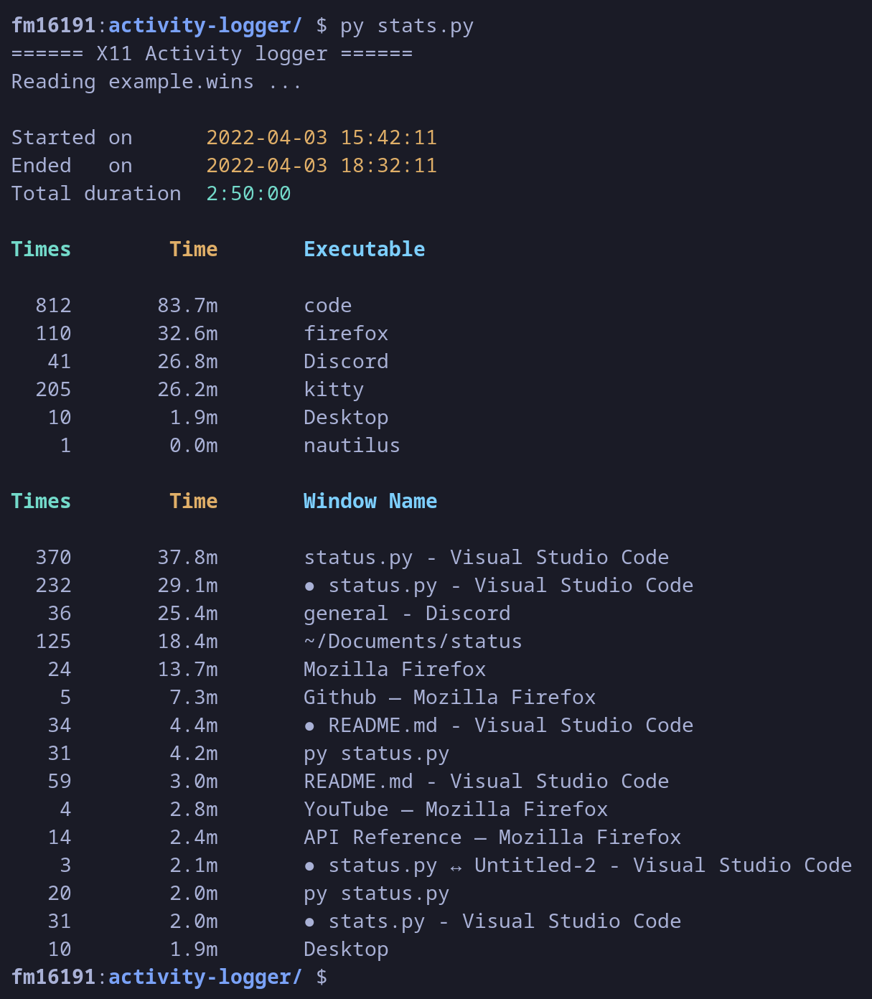
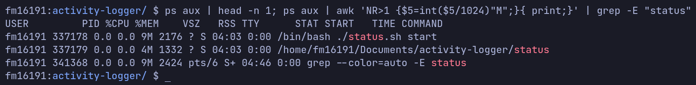
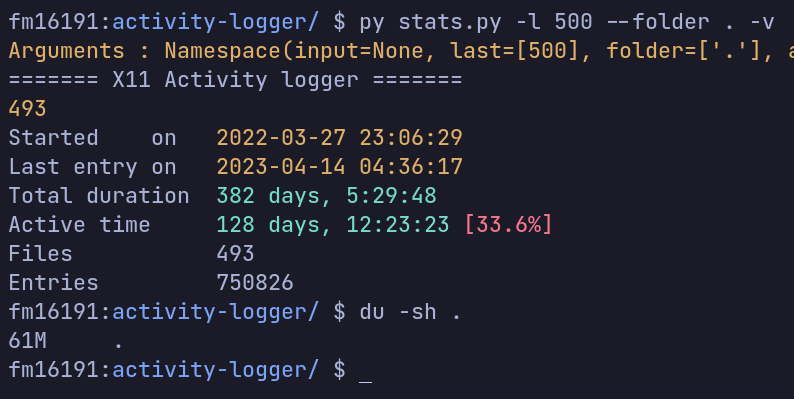
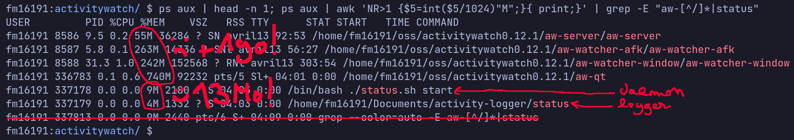
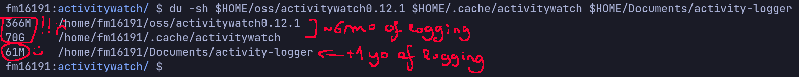

# Activity Logger

**Activity Logger** is a lightweigt activity logger written in C for X11 (and wayland, see [below](#wayland-support)).

**Activity Logger** is *extremely* **lightweight**. How much you may ask, and why such a claim ? Well, see in [section below](#so-lightweight-you-forget-its-active)


# Features

- Session duration with first and last entry
- Sort applications by time spent on them
- Sort windows names by time spent on them
- Longuest sessions without window switching
- Analyze multiple log files
- Filter activities by keywords
- A daemon

Todolist : 
- [x] Autorestart if the logger fails (daemon)
- [x] Adapt the ouput size with the terminal size (displays ... if too long)
- [x] Detects if file is empty.
- [x] Add argument parsing, for each output
- [x] Longests sessions without window switching
- [x] Output time in days & hours & minutes according to their duration
- [x] Analyze multiple log files at once (`-l X`)
- [x] Add active time (with %)
- [ ] Add % per application on total active time
- [x] Print active time removing `Shutdown` and `Desktop` activities (`--factive`)
- [ ] Change active time for the used activity when using the filter option
- [x] -a / --all flag
- [x] Exclude, filter activites by keywords
- [x] Add option to exclude "Desktop" window logs
- [x] Add a folder option for all .wins files
- [ ] ~~Add openrc script & update README~~
- [x] Update filter to also support exact queries
- [x] Split a logfile in two
- [x] Output time in seconds if < to  min
- [x] Support reading last N logfiles by first entry
- [ ] Support wayland ! *- It's almost here ! see [below](#wayland-support)*
- [ ] Complete README. It's missing so much stuff
- [x] Fix bug when the last entry has a [XXX-999] timestamp
- [ ] Correct file encoding issue
- [ ] Activity history with duration and in tree if same process
- [ ] ~~Sort windows names by application name~~
- [ ] Add window name on startup
- [ ] Add the timestamp of longuests sessions
- [x] Read last files by header instead of by date modification (i.e subsequent modification)
- [x] Dumping data (--json)
- [ ] Ignore window switch if long session interupted by a quick switch

Ideas - Keylogger feature
- [ ] Sort applications according to the number of keystrokes made
- [ ] Sort applications according to the keyboard typing speed
- [ ] Add options for statistics for the number of keystrokes per sessions, window name, applications
- [ ] Keylogging only for specified applications.
- [ ] Detect when user is AFK ? (i.e. no mouse or keyboard events for x seconds, which would no longer require the user to need to change the targeted window on the desktop (none) before going AFK).

# Exemple output



# Usage

> Compile the code.

`make`

> To start the logger

`./status.sh start`

> To start the logger as a daemon. Always keeps an instance running.
> 
> Checks if an instance is running and if not start one.

`./status.sh daemon`

> Start the logger in a specific folder. By default, log files will be dumped in current folder, if LOGGER_DIR env variable has not been set.

`LOGGER_DIR=data ./status.sh daemon`

> To stop the daemon

`./status.sh kill`

> To stop all running instances. Note : if the daemon is running, it will restart one.

`./status.sh stop`

> At any time, you can watch where a summary of your latest activities by using

`py stats.py` or `py stats.py <date>.wins`

> By default, if no log file is specified, the last modified .wins file will be read.

# So lightweight you forget it's active !

When running, the logger uses only 13 MB of RAM.



Over on year of activity has been logged for only 61Mo.



The logger only dumps when a window change is detected, and this when some events are triggered by the desktop environment API.
*activity-logger* lacks an AFK detector, but this is the todo-list. You can always specify AFK (shown as Desktop) times, using the `clean.sh` file or manual edits.

The code itself is light, with only 400 lines of code, but it also consumes extremely little, especially when compared to activity-watch, which admittedly has more features and is prettier, but is also much much more bloated.




# Wayland support

Wayland support is *almost* here !

Well, it can be compiled ! but with some extra unecessary steps ... \
Let me explain ! 

Here's the (unecessary overkill) installation process for wayland support : 
- Clone and install the [`wlroots` git repository](https://gitlab.freedesktop.org/wlroots/wlroots.git)
- copy the `wayland_logger.c` file to `wlroots/examples/`
- edit `wlroots/examples/meson.build`, and in the `clients = {`, section (~ line 60) append the following :
  ```meson
  	'wayland_logger': {
		'src': 'wayland_logger.c',
		'proto': ['wlr-foreign-toplevel-management-unstable-v1'],
	},
  ```
- now in `wlroots/`, compile ! : 
  ```bash
  $ meson setup --reconfigure build
  $ cd build
  $ ninja
  ```
- Copy the compiled executable to `activity-logger/`

Here it should work. \
Despite my best efforts so far, I haven't managed to enable a simplified compilation with just the bare essentials ... but I'd be very grateful for anyone who'd like to help solve the problem! Don't hesitate to open a PR or come discuss about it at #2

# Keylogger feature (not included by default)
In addition, a small keylogger has been implemented, which is not yet in use. It could be used in the future.

To enable it, `git apply keylogger.diff`.

For each keystroke, a new line will be written in `<date>.keys` including the timestamp in microseconds, the mouse position at that moment, the state and the code of the key.

# Known issues

> This tool is in beta stage. Please don't mind if you you encounter a problem, and feel free to open an Issue for any suggestion or bug !

- A `free(): invalid pointer` and `IOT instruction` errors occurs at program stop. Not sure why they appear ?
