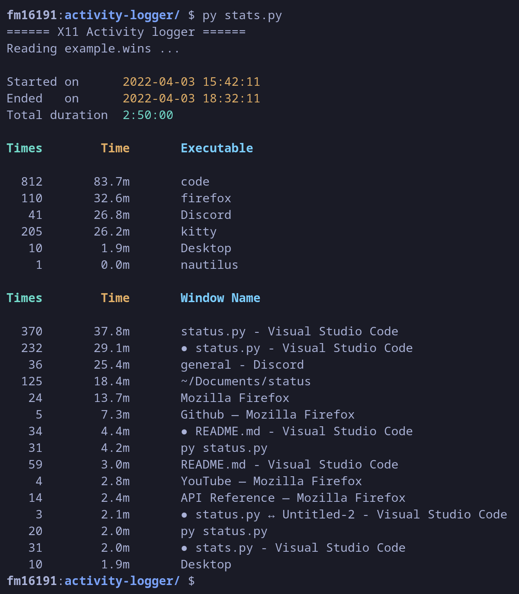

# X11 Activity Logger

**X11 Activity Logger** is a lightweigt activity logger written in C for X11.

# Features

- Session duration with first and last entry
- Sort applications by time spent on them
- Sort windows names by time spent on them
- Longuest sessions without window switching

To be added :
- [x] Autorestart if the logger fails (daemon)
- [x] Adapt the ouput size with the terminal size (displays ... if too long)
- [x] Detects if file is empty.
- [x] Add argument parsing, for each output
- [x] Longests sessions without window switching
- [x] Output time in days & hours & minutes according to their duration
- [x] Analyze multiple log files at once
- [x] Add active time (with %)
- [x] -a / --all flag
- [x] Add keywords exclusion --exclude <file / keywords>
- [x] Add option to exclude "Desktop" window logs
- [ ] Support reading last N logfiles by date modification
- [ ] Correct file encoding issue
- [ ] Activity history with duration and in tree if same process
- [ ] Sort windows names by application name
- [ ] Filter activities with keywords
- [ ] Add window name on startup
- [ ] Add the timestamp of longuests sessions
- [ ] Read last files by header instead of by date modification (i.e subsequent modification)
- [ ] Dumping data
- [ ] Ignore window switch if long session interupted by a quick switch

Ideas - Keylogger feature
- [ ] Sort applications according to the number of keystrokes made
- [ ] Sort applications according to the keyboard typing speed
- [ ] Add options for statistics for the number of keystrokes per sessions, window name, applications
- [ ] Keylogging only for specified applications.
- [ ] Detect when user is AFK ? (i.e. no mouse or keyboard events for x seconds, which would no longer require the user to need to change the targeted window on the desktop (none) before going AFK).

# Exemple output

# Usage

> Compile the code.

`make`

> To start the logger

`./status.sh start`

> To start the logger as a daemon. Always keeps an instance running.
> 
> Checks if an instance is running and if not start one.

`./status.sh daemon`

> To stop the daemon

`./status.sh kill`

> To stop all running instances. Note : if the daemon is running, it will restart one.

`./status.sh stop`

> At any time, you can watch where a summary of your latest activities by using

`py stats.py` or `py stats.py <date>.wins`

> By default, if no log file is specified, the last modified .wins file will be read.

# Keylogger feature (not included by default)
In addition, a small keylogger has been implemented, which is not yet in use. It could be used in the future.

To enable it, `git apply keylogger.diff`.

For each keystroke, a new line will be written in `<date>.keys` including the timestamp in microseconds, the mouse position at that moment, the state and the code of the key.

# Known issues

> This tool is in beta stage. Please don't mind if you you encounter a problem, and feel free to open an Issue for any suggestion or bug !

- A `free(): invalid pointer` and `IOT instruction` errors occurs at program stop. Not sure why they appear ?
